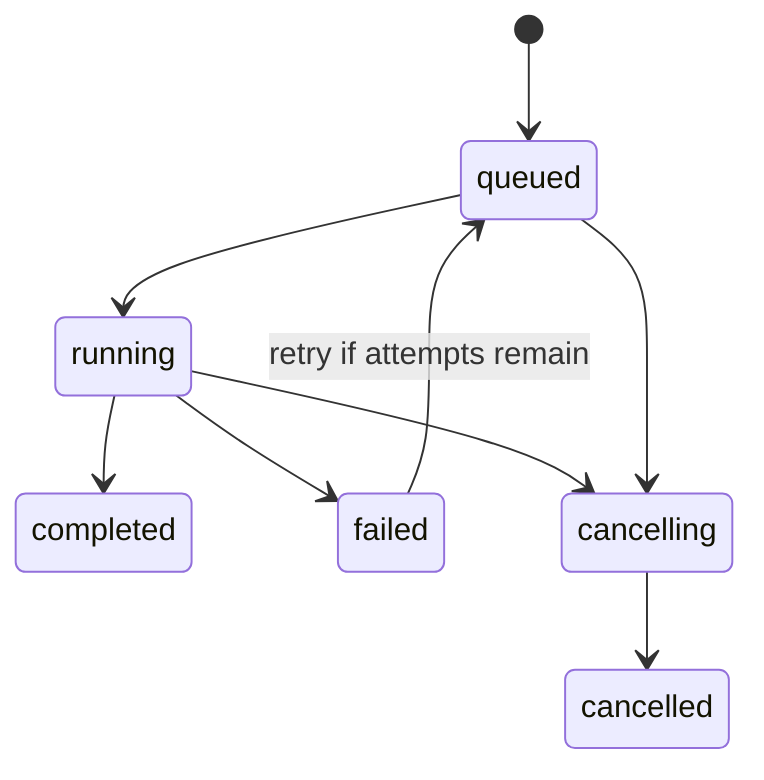

# F2 Worker Queue Design

> **Type:** Migrated design and implementation record.
> **Status:** Implemented.
> **Version:** 1.0 - 2026-06-03.
> **Scope:** SQLite-backed job queue, worker execution, retry, progress, and cancellation.

This document records the F2 worker-queue design after migration from the
legacy TidalHires design notes. It is rebranded for Mintarr and trimmed to the
public runtime contract: no private host paths, no local deployment topology,
and no credentials.

## 1. Problem

Mintarr has to accept a Lidarr grab immediately, then run a much slower
pipeline:

1. Fetch raw files from the selected source.
2. Normalize and prepare the album directory.
3. Run verification and quality checks.
4. Import or hold/reject based on policy.
5. Keep enough state for dashboards, retry, cancellation, and audit.

The SAB-compatible API cannot block for that work. Lidarr expects the grab
request to return quickly and then poll queue/history state. F2 introduced the
internal queue that makes this possible.

## 2. Goals

- Accept SAB `addurl` quickly and return a job id.
- Persist jobs in SQLite so restarts do not lose pending work.
- Keep sidecars and audit files as the evidence source of truth.
- Provide a queryable job index for dashboards and HTTP APIs.
- Support retries, cancellation, progress, and terminal result state.
- Keep the first implementation simple: one worker thread by default.

## 3. Non-goals

- No Redis, Celery, or separate broker in the v1 architecture.
- No distributed worker pool.
- No multi-tenant scheduling.
- No tracker-specific policy in the queue layer.
- No replacement for sidecar evidence.

## 4. Queue Storage

Mintarr uses the `jobs` table in `state_db` as the durable queue. The database
path is selected from `MINTARR_STATE_DB` or the container default.

Important columns:

| Column | Purpose |
|---|---|
| `jid` | Public job id used by SAB/Lidarr compatibility and dashboards. |
| `type` | Executor type, for example `tidal_grab`, `local_grab`, or `soulseek_grab`. |
| `state` | Queue state: `queued`, `running`, `cancelling`, `completed`, `failed`, `cancelled`. |
| `result_state` | Pipeline result such as imported, blocked, review, or import-failed. |
| `priority` | Numeric priority for scheduler ordering. |
| `attempts`, `max_attempts` | Retry accounting. |
| `next_attempt_at` | Delay gate before a retry can run. |
| `heartbeat_at`, `lease_expires_at` | Worker liveness and restart recovery. |
| `dedupe_key` | Active-job dedupe key. Usually `source_type:<id-or-hash>`. |
| `source_type`, `source_id` | Source provenance threaded through jobs and sidecars. |
| `payload_json` | Executor payload. Must contain only source-local identifiers and safe metadata. |
| `progress_json` | Current stage, percentage, and message for dashboard/API readers. |
| `result_json` | Terminal structured result. |
| `error_text` | Human-readable terminal error for failed jobs. |
| `worker_id` | Worker lease owner. |
| `cancel_requested` | Cooperative cancellation flag. |

Indexes cover queue selection, job id lookup, created-at ordering, dedupe, and
lease recovery.

## 5. State Machine

State rules:

- `queued`, `running`, and `cancelling` are active states.
- `completed`, `failed`, and `cancelled` are terminal states.
- A retry creates another `queued` attempt for the same logical job.
- Cancellation is cooperative. Long-running executors must poll the context
  cancellation hook at natural boundaries.
- A worker owns a running job through a lease. Expired leases can be recovered.

## 6. Worker Model

The default runtime uses one in-process worker thread. That is intentional:

- Music imports are I/O-heavy and can collide on filesystem and Lidarr state.
- One worker keeps dogfood behavior easy to inspect.
- The queue schema can support more workers later without changing the public
  HTTP contract.

The worker loop claims the next eligible job, creates a `PipelineContext`, runs
the executor registered for `job.type`, updates progress, and writes terminal
state.

## 7. Executor Boundary

F2 established the boundary that later F3 source adapters use:

- The queue knows job type, payload, provenance, and execution state.
- The executor knows how to fetch raw files for that source.
- The common pipeline owns normalization, verification, import, sidecars, and
  audit decisions.

This keeps source-specific code out of the queue and keeps queue mechanics out
of adapters.

## 8. SAB/Lidarr Compatibility

Mintarr exposes a SAB-compatible API because Lidarr already understands SAB
queue and history polling.

F2 compatibility requirements:

- `addurl` publishes a job projection before returning to Lidarr.
- Queue and history endpoints can answer while the durable worker job exists.
- TIDAL jobs retain the legacy `album_id` projection for older readers.
- Newer readers should use `source_type` and `source_id`.

The API key is supplied by the operator at runtime. Public examples should use
placeholders such as `<your-api-key>`.

## 9. Retry

Retries are for transient failures:

- network failures
- temporary upstream API errors
- temporary filesystem or Lidarr availability issues
- worker crashes or expired leases

Retries are not for deterministic policy failures, such as verification
rejection or invalid source identifiers. Those should finish as terminal job
results with auditable evidence.

## 10. Cancellation

Cancellation is cooperative and source-aware:

- Dashboards set `cancel_requested` for a job.
- `PipelineContext.check_cancelled()` raises at safe boundaries.
- `PipelineContext.run_subprocess()` handles child-process cancellation.
- Adapters can implement `cleanup(jid, ctx)` for source-specific teardown.

Cancellation should not corrupt sidecars, downloaded files, or Lidarr queue
state. Partial output remains inspectable unless a later cleanup policy
explicitly removes it.

## 11. Progress

Progress is stored as structured JSON so the dashboard and APIs can show:

- stage
- percentage
- message
- optional source-specific detail

Progress is best-effort. A missing progress row must not break queue polling or
job recovery.

## 12. Source Provenance

F2 was extended by F3 to carry source provenance through the queue:

- `jobs.source_type`
- `jobs.source_id`
- `records.source_type`
- sidecar `source_type`

Legacy records without `source_type` mean `tidal`.

## 13. Safety Invariants

- Sidecars and `decisions.jsonl` remain the audit source of truth.
- SQLite is the query and queue index.
- Queue writes are defensive where possible; dashboard/index failure must not
  destroy the evidence trail.
- Job payloads must not contain credentials.
- Logs and docs must not print API keys or source credentials.

## 14. Implementation Record

F2 landed as an additive queue layer:

- SQLite `jobs` table and helper functions.
- SAB-compatible `addurl`, queue, and history projection.
- Worker execution path for TIDAL grabs.
- Retry metadata and lease fields.
- Cooperative cancellation hooks.
- Progress JSON for dashboards.
- Later source adapter work reused the same queue contract for LocalFolder and
  Soulseek.

## 15. Related Documents

- [Pipeline architecture](../architecture/PIPELINE.md)
- [Data model](../architecture/DATA_MODEL.md)
- [HTTP API v1](../specs/HTTP_API_v1.md)
- [F3 source adapters](F3_SOURCE_ADAPTERS_DESIGN.md)
