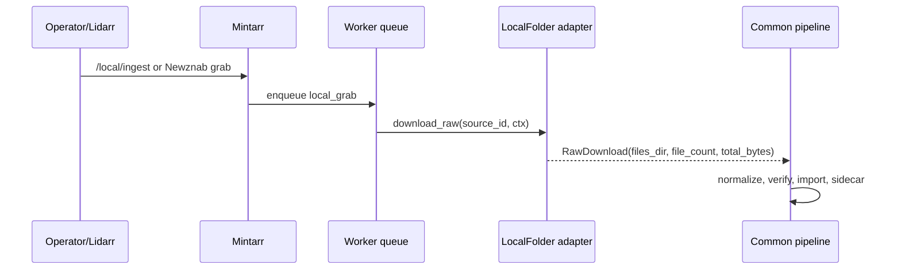

# F3.4 LocalFolder Design

> **Type:** Migrated design and implementation record.
> **Status:** Implemented.
> **Version:** 1.0 - 2026-06-03.
> **Scope:** LocalFolder source adapter, `/local/ingest`, path safety, and worker integration.

This document is the public Mintarr migration of the legacy F3.4 LocalFolder
design. It has been translated, rebranded, and cleaned of private repository
references.

## 1. Problem

Operators often already have local albums that should go through the same
Mintarr verification and Lidarr import path as remote downloads. Before F3.4,
the practical choice was manual import or source-specific shortcuts.

LocalFolder makes a local directory behave like a Mintarr source while keeping
the common pipeline intact.

## 2. Goals

- Ingest an album directory under a configured root.
- Copy files into the Mintarr raw-job directory.
- Run the normal normalize, verify, decision, and import pipeline.
- Persist source provenance as `local`.
- Reject path traversal and symlink escapes.
- Support both direct API ingest and later Newznab search visibility.

## 3. Non-goals

- No mutation of the source directory.
- No recursive library management.
- No file deletion from the ingest root.
- No bypass around verification.
- No special LocalFolder import policy in F3.4.
- No publication of private host paths.

## 4. Configuration

LocalFolder is enabled when:

- `LOCAL_INGEST_PATH` is configured
- the configured root exists and is readable
- the connector runtime allows the source to run

The value is a container path, not a public host path. Documentation and
examples should use placeholders such as `/mnt/local-ingest`.

## 5. Adapter Contract

LocalFolder implements the standard `SourceAdapter` contract:

| Field/method | LocalFolder behavior |
|---|---|
| `name` | `local` |
| `source_type` | `local` |
| `is_enabled()` | true only when the ingest root is configured and usable |
| `search()` | returns album directories with supported audio files |
| `normalize_candidate_id()` | canonicalizes a relative path under the ingest root |
| `download_raw()` | copies files from the candidate directory into `ctx.raw_dir` |
| `cleanup()` | no source mutation |

The adapter reports `ReleaseCandidate` titles such as:

```text
Artist - Album (FLAC) [Local]
```

## 6. `/local/ingest`

The direct ingest endpoint enqueues a LocalFolder job:

```http
POST /local/ingest
Content-Type: application/json

{"path": "Artist/Album"}
```

The endpoint:

1. validates authentication
2. validates that LocalFolder is enabled
3. canonicalizes the relative path through the adapter
4. creates a `local_grab` worker job
5. stores `source_type=local` and `source_id=<canonical-relative-path>`
6. returns the job id

The endpoint accepts source-local identifiers only. It does not accept absolute
host paths.

## 7. Path Safety

LocalFolder treats local filesystem input as untrusted.

Rules:

- paths must be relative
- absolute paths are rejected
- `..` traversal is rejected by resolved-path checks
- symlinked path components are rejected
- symlinked files are rejected during copy
- the resolved source directory must stay inside `LOCAL_INGEST_PATH`
- the source must be a directory
- at least one supported audio file must be copied

The adapter validates the path at enqueue time and again during `download_raw()`
as defense in depth.

## 8. Copy Semantics

LocalFolder is copy-only:

- source files remain untouched
- directory structure below the album directory is preserved
- file metadata is copied where the platform supports it
- the copy target is the Mintarr raw directory for that job
- downstream normalize/verify/import stages operate on the copied files

Copy-only behavior makes retries and failed imports safer: the operator's
source directory remains intact.

## 9. Worker Integration

LocalFolder uses the same queue and pipeline as other sources:



The job carries:

- `type=local_grab`
- `source_type=local`
- `source_id=<relative-path>`
- a source-aware dedupe key

## 10. Search Visibility

F3.4 introduced the LocalFolder adapter and direct ingest path. F3.2/F3.3 then
made LocalFolder candidates visible through Newznab search:

- artist directories are scanned under `LOCAL_INGEST_PATH`
- album directories with supported audio files become `ReleaseCandidate`s
- LocalFolder candidates use `[Local]` title tags
- Newznab routing sends selected candidates back to `local_grab`

This lets Lidarr select local candidates through the same indexer/download
client flow used by other sources.

## 11. Security Invariants

- No real host path should appear in public docs.
- The API key is never included as a literal value in examples.
- LocalFolder never follows symlinks out of the ingest root.
- The adapter never deletes or mutates source files.
- The direct endpoint never accepts absolute paths.
- `source_id` is a canonical relative path, not a host path.

## 12. Tests

Required coverage:

- LocalFolder disabled when `LOCAL_INGEST_PATH` is absent.
- path traversal is rejected.
- absolute paths are rejected.
- symlinked path components are rejected.
- symlinked files are rejected.
- non-directories are rejected.
- empty/no-audio directories are rejected.
- valid directories copy into `ctx.raw_dir`.
- `/local/ingest` enqueues `local_grab` with `source_type=local`.
- duplicate active local ingests dedupe correctly.
- LocalFolder search returns safe `ReleaseCandidate`s.

## 13. Implementation Record

F3.4 landed:

- `LocalFolderAdapter`
- direct `/local/ingest` endpoint
- copy-only `download_raw()`
- strict path canonicalization
- local provenance in jobs and sidecars
- LocalFolder executor path through the shared pipeline

Later F3.2/F3.3 routing work exposed LocalFolder candidates through the
Newznab/SAB flow, and F4 connector work exposed LocalFolder status in the
dashboard.

## 14. Related Documents

- [F3 source adapters](F3_SOURCE_ADAPTERS_DESIGN.md)
- [F3.2/F3.3 Newznab routing](F3.2_F3.3_NEWZNAB_ROUTING_DESIGN.md)
- [F2 worker queue](F2_WORKER_QUEUE_DESIGN.md)
- [HTTP API v1](../specs/HTTP_API_v1.md)
