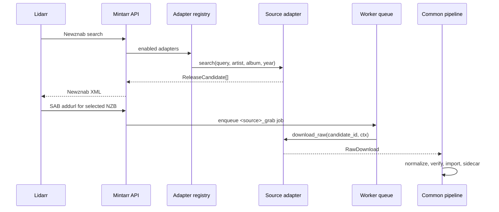

# F3 Source Adapters Design

> **Type:** Migrated design and implementation record.
> **Status:** Implemented.
> **Version:** 1.0 - 2026-06-03.
> **Scope:** Source adapter protocol, adapter registry, provenance, and shared pipeline boundary.

This document is the public Mintarr migration of the legacy F3 source-adapter
design. It preserves the locked contract while removing private repository
links and obsolete planning references.

## 1. Problem

The original pipeline was effectively TIDAL-shaped: search, grab, normalize,
verify, and import were coupled to one source. Mintarr needs additional sources
without cloning the verification/import pipeline for each one.

F3 introduced the source-adapter boundary:

- adapters fetch raw candidate files
- the common pipeline normalizes, verifies, decides, imports, and audits
- every record carries source provenance

## 2. Goals

- Add sources without rewriting verification or import.
- Let all sources surface as Lidarr-searchable Newznab candidates.
- Route a Lidarr grab back to the exact selected adapter and candidate.
- Persist source provenance in jobs, records, and sidecars.
- Keep adapters small, testable, and decoupled from Flask internals.
- Keep the connector/plugin layer separate from source execution.

## 3. Non-goals

- No source-specific import pipeline.
- No adapter imports from `server.py` or dashboard code.
- No per-source bypass around verification.
- No Node, browser, or dashboard framework decision in F3.
- No distributed plugin runtime. Python adapters run in the Mintarr process.

## 4. Core Contract

The runtime contract lives in `app/adapters/base.py`.

```python
@dataclass(frozen=True)
class ReleaseCandidate:
    source_type: str
    source_id: str
    title: str
    artist: str
    album: str
    year: int | None
    quality_tag: str
    size_bytes: int
    download_url: str
    priority: int = 50
    extra: dict = field(default_factory=dict)

    @property
    def guid(self) -> str:
        return f"{self.source_type}:{self.source_id}"
```

```python
@dataclass(frozen=True)
class RawDownload:
    files_dir: Path
    file_count: int
    total_bytes: int
```

```python
class SourceAdapter(Protocol):
    name: str
    source_type: str

    def is_enabled(self) -> bool: ...
    def search(self, query: str, artist: str = "", album: str = "", year: int | None = None) -> list[ReleaseCandidate]: ...
    def download_raw(self, candidate_id: str, ctx: PipelineContext) -> RawDownload: ...
    def cleanup(self, jid: str, ctx: PipelineContext) -> None: ...
```

Adapter requirements:

- `source_type` is stable and globally identifies the source family.
- `ReleaseCandidate.guid` is `source_type:source_id`.
- `search()` should return quickly enough for Lidarr indexer polling.
- `download_raw()` writes raw files under `ctx.raw_dir`.
- Long operations must call `ctx.set_progress()` and `ctx.check_cancelled()`.
- Subprocesses must go through `ctx.run_subprocess(...)`.
- Adapters must not import `server.py` or pipeline internals.

## 5. Pipeline Context

`PipelineContext` is the adapter's safe handle into the worker runtime. It
provides:

- job id
- raw/output paths
- progress updates
- cancellation checks
- subprocess handling
- source-local metadata needed by the executor

The context is deliberately narrower than the Flask app. This keeps adapters
portable and prevents source code from mutating dashboard, request, or Lidarr
state directly.

## 6. Registry

The adapter registry owns source discovery in the running process:

- TIDAL is the legacy/default source.
- LocalFolder is enabled when `LOCAL_INGEST_PATH` is configured and the
  connector runtime allows it.
- Soulseek is enabled through the connector runtime and the implemented
  completed-folder/slskd flows.

The registry is source execution plumbing. The F4 connector registry describes
operator-facing integration status and configuration metadata. Those concepts
overlap in names, but they are not the same layer.

## 7. Search and Grab Flow



## 8. Provenance

Mintarr stores source provenance at every durable boundary:

- `jobs.source_type`
- `jobs.source_id`
- `records.source_type`
- sidecar `source_type`
- `ReleaseCandidate.guid`
- dedupe key prefixes

Legacy records without `source_type` are treated as TIDAL.

## 9. Adapter Ownership

Adapters own:

- translating a Mintarr search request into source-specific search logic
- returning `ReleaseCandidate` objects
- validating source-local candidate identifiers
- fetching/copying raw files
- source-specific cleanup on cancellation or failure

Adapters do not own:

- verification scoring
- policy decisions
- Lidarr import
- sidecar schema
- dashboard state
- HTTP authentication

## 10. Source Types

Implemented source types:

| Source type | Executor | Notes |
|---|---|---|
| `tidal` | `tidal_grab` | Legacy source. Missing source provenance is interpreted as TIDAL. |
| `local` | `local_grab` | LocalFolder copy-only ingest and Newznab-searchable local library. |
| `soulseek` | `soulseek_grab` | See [F3.5 completed-folder ingest](F3.5_SOULSEEK_COMPLETED_INGEST.md) and [F3.5B slskd trigger](F3.5B_SOULSEEK_SLSKD_TRIGGER.md). |

Future adapters should add a stable `source_type`, a focused adapter module,
unit tests, and connector metadata if the operator needs configuration/status
surface.

## 11. Dedupe

The dedupe key is source-aware by design. Two sources can offer the same album
without collapsing into the same active job:

- TIDAL: `tidal:<album-id>`
- LocalFolder: `local:<hash-of-relative-path>`
- Soulseek: `soulseek:<hash-of-relative-path>`

This prevents a local copy and a remote source candidate from masking each
other in Lidarr dogfood.

## 12. Compatibility

The SAB/Newznab emulation remains stable for Lidarr. Internally, F3 shifts the
job payload from TIDAL-specific identifiers toward `source_type` and
`source_id`.

Backward compatibility details:

- TIDAL jobs may still expose `album_id` in the in-memory SAB projection.
- Legacy records without `source_type` mean `tidal`.
- The Newznab pointer NZB still uses legacy metadata names
  `tidalhires_source` and `tidalhires_source_id` on the wire for compatibility.
  New code should read them as source metadata, not as branding.

## 13. Testing

Coverage should exist at these boundaries:

- adapter protocol dataclass and `guid` contract
- adapter registry enabled/disabled behavior
- source-type persistence in jobs, records, and sidecars
- Newznab aggregation across multiple adapters
- source-aware SAB `addurl` routing
- local path safety and copy behavior
- cancellation and progress hooks
- failure isolation so one broken adapter does not break all search results

## 14. Implementation Record

F3 landed across several steps:

- F3.1: base protocol, source provenance, and TIDAL adapter extraction.
- F3.2/F3.3: Newznab aggregation and source-aware grab routing.
- F3.4: LocalFolder adapter and `/local/ingest`.
- F3.5: Soulseek completed-folder and slskd-backed flows.
- F4 work later added connector status/configuration surfaces without changing
  the adapter execution contract.

## 15. Related Documents

- [F2 worker queue](F2_WORKER_QUEUE_DESIGN.md)
- [F3.2/F3.3 Newznab routing](F3.2_F3.3_NEWZNAB_ROUTING_DESIGN.md)
- [F3.4 LocalFolder](F3.4_LOCAL_FOLDER_DESIGN.md)
- [F3.5 completed-folder ingest](F3.5_SOULSEEK_COMPLETED_INGEST.md)
- [Adapter protocol v1](../specs/ADAPTER_PROTOCOL_v1.md)
- [Connector/plugin architecture](CONNECTOR_PLUGIN_ARCHITECTURE.md)
